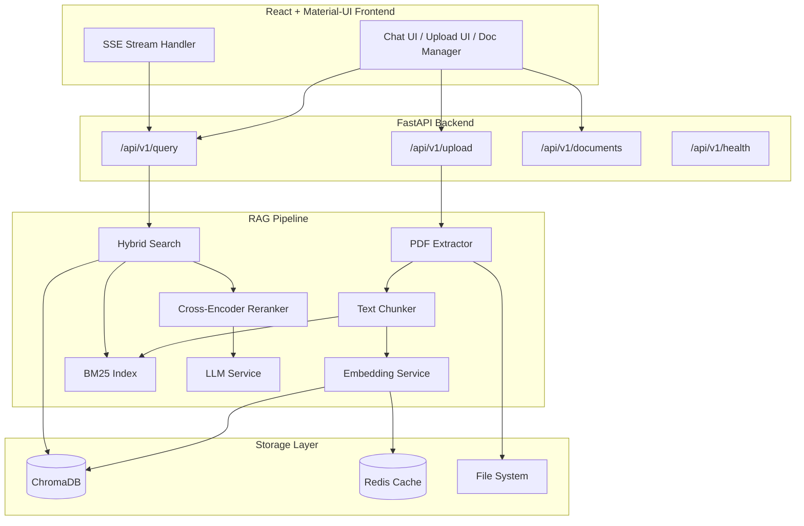

# Ask My Documents — Enterprise RAG System

A production-ready Retrieval Augmented Generation application enabling users to upload PDF documents and get AI-powered answers with precise citations.

## System Architecture



---

## User Review Required

> [!IMPORTANT]
> **LLM Provider**: The system supports both OpenAI API and local Ollama models. For Phase 1, I will implement OpenAI integration first (since it's simpler to test) and add Ollama support alongside it. If you prefer Ollama-first, please let me know.

> [!IMPORTANT]
> **Embedding Model**: The plan uses `BAAI/bge-small-en-v1.5` (384 dims) as specified. This model will be downloaded on first run (~130MB). If you'd prefer an API-based embedding (e.g., OpenAI `text-embedding-3-small`), let me know.

> [!WARNING]
> **GPU Requirement**: Cross-encoder reranking (Phase 2) runs locally. On CPU-only machines, reranking adds ~1-2s latency per query. The system will auto-detect GPU availability and adjust batch sizes accordingly.

> [!IMPORTANT]
> **Redis Dependency**: Redis is used for caching in Phase 3. For Phase 1-2, we'll use in-memory LRU caching. Redis becomes required only in production deployment. Is Redis available in your environment, or should I keep the LRU fallback as primary?

> [!CAUTION]
> **ChromaDB Security (CVE-2026-45829)**: A Remote Code Execution vulnerability affects the ChromaDB Python FastAPI server in all versions ≥1.0.0. For production, we should either (a) use the Rust-based `chroma run` server, or (b) gate requests behind authentication at a reverse proxy. For local development, this is acceptable. I'll document the mitigation in the deployment config.

## Open Questions

1. **OpenAI API Key**: Do you already have an OpenAI API key, or should I default to Ollama for local-only development?
2. **File Size Limit**: The spec mentions both 10MB and 50MB limits. I'll implement 50MB max with a warning at 10MB. Does that work?
3. **Deployment Target**: Are you deploying to cloud (AWS/GCP/Azure), a VPS, or running locally only? This affects the Docker configuration.
4. **Database Persistence**: ChromaDB will persist to `./data/chroma`. Should I configure a different path?

---

## Project Structure

```
ask-my-documents/
├── backend/
│   ├── app/
│   │   ├── __init__.py
│   │   ├── main.py                    # FastAPI app factory, middleware, CORS
│   │   ├── config.py                  # Pydantic settings management
│   │   ├── api/
│   │   │   ├── __init__.py
│   │   │   ├── router.py              # API router aggregation
│   │   │   ├── endpoints/
│   │   │   │   ├── __init__.py
│   │   │   │   ├── upload.py          # POST /upload
│   │   │   │   ├── query.py           # POST /query (with SSE streaming)
│   │   │   │   ├── documents.py       # GET/DELETE /documents
│   │   │   │   └── health.py          # GET /health
│   │   │   ├── models/
│   │   │   │   ├── __init__.py
│   │   │   │   ├── requests.py        # Pydantic request schemas
│   │   │   │   └── responses.py       # Pydantic response schemas
│   │   │   └── dependencies.py        # Dependency injection
│   │   ├── core/
│   │   │   ├── __init__.py
│   │   │   ├── exceptions.py          # Custom exceptions
│   │   │   ├── logging_config.py      # Structured logging setup
│   │   │   └── middleware.py          # Rate limiting, error handling
│   │   ├── services/
│   │   │   ├── __init__.py
│   │   │   ├── pdf_service.py         # PDF text extraction
│   │   │   ├── chunking_service.py    # Text splitting strategies
│   │   │   ├── embedding_service.py   # Embedding generation + caching
│   │   │   ├── vector_store.py        # ChromaDB operations
│   │   │   ├── bm25_service.py        # BM25 sparse retrieval
│   │   │   ├── hybrid_search.py       # Hybrid search + RRF fusion
│   │   │   ├── reranker_service.py    # Cross-encoder reranking
│   │   │   ├── llm_service.py         # OpenAI / Ollama LLM calls
│   │   │   └── rag_pipeline.py        # End-to-end RAG orchestration
│   │   └── repositories/
│   │       ├── __init__.py
│   │       └── document_repository.py # Document CRUD + metadata
│   ├── tests/
│   │   ├── __init__.py
│   │   ├── conftest.py                # Shared fixtures
│   │   ├── unit/
│   │   │   ├── test_pdf_service.py
│   │   │   ├── test_chunking.py
│   │   │   ├── test_embedding.py
│   │   │   └── test_hybrid_search.py
│   │   └── integration/
│   │       ├── test_upload.py
│   │       ├── test_query.py
│   │       └── test_pipeline.py
│   ├── evaluation/
│   │   ├── ragas_eval.py              # RAGAS evaluation pipeline
│   │   ├── test_generator.py          # Synthetic test set generation
│   │   └── dashboard.py              # Metrics visualization
│   ├── requirements.txt
│   ├── Dockerfile
│   ├── .env.example
│   └── pyproject.toml
├── frontend/
│   ├── public/
│   │   └── index.html
│   ├── src/
│   │   ├── index.js
│   │   ├── App.js
│   │   ├── theme.js                   # MUI theme (dark/light)
│   │   ├── api/
│   │   │   └── client.js              # Axios + SSE client
│   │   ├── components/
│   │   │   ├── Layout/
│   │   │   │   ├── Sidebar.jsx
│   │   │   │   ├── Header.jsx
│   │   │   │   └── MainLayout.jsx
│   │   │   ├── Upload/
│   │   │   │   ├── DropZone.jsx
│   │   │   │   ├── UploadProgress.jsx
│   │   │   │   └── FileQueue.jsx
│   │   │   ├── Chat/
│   │   │   │   ├── ChatWindow.jsx
│   │   │   │   ├── MessageBubble.jsx
│   │   │   │   ├── QueryInput.jsx
│   │   │   │   ├── StreamingText.jsx
│   │   │   │   └── CitationCard.jsx
│   │   │   ├── Documents/
│   │   │   │   ├── DocumentList.jsx
│   │   │   │   ├── DocumentCard.jsx
│   │   │   │   └── DocumentPreview.jsx
│   │   │   └── Common/
│   │   │       ├── ThemeToggle.jsx
│   │   │       ├── LoadingSpinner.jsx
│   │   │       └── ErrorBoundary.jsx
│   │   ├── hooks/
│   │   │   ├── useUpload.js
│   │   │   ├── useQuery.js
│   │   │   ├── useDocuments.js
│   │   │   └── useSSE.js
│   │   ├── context/
│   │   │   ├── ThemeContext.js
│   │   │   └── ChatContext.js
│   │   └── utils/
│   │       ├── formatters.js
│   │       └── validators.js
│   ├── package.json
│   ├── Dockerfile
│   └── .env.example
├── docker-compose.yml
├── docker-compose.prod.yml
├── .env.example
├── README.md
└── Makefile
```

---

## Proposed Changes — Phase 1: Core RAG

Phase 1 delivers a fully functional RAG pipeline with a polished UI.

---

### Backend Core

#### [NEW] [config.py](file:///C:/Users/shubh/.gemini/antigravity/scratch/ask-my-documents/backend/app/config.py)
- Pydantic `BaseSettings` with environment variable loading
- All configurable values: `CHUNK_SIZE`, `CHUNK_OVERLAP`, `TOP_K`, `LLM_MODEL`, `CHROMA_PATH`, `EMBEDDING_MODEL`, `OPENAI_API_KEY`, `OLLAMA_BASE_URL`
- Validation for required keys based on selected LLM provider

#### [NEW] [main.py](file:///C:/Users/shubh/.gemini/antigravity/scratch/ask-my-documents/backend/app/main.py)
- FastAPI app factory pattern with lifespan context manager
- CORS middleware (configurable origins)
- Global exception handlers for custom exceptions
- Request ID middleware for tracing
- Startup: initialize ChromaDB, warm embedding model
- Shutdown: graceful cleanup

#### [NEW] [exceptions.py](file:///C:/Users/shubh/.gemini/antigravity/scratch/ask-my-documents/backend/app/core/exceptions.py)
- `DocumentNotFoundError`, `DocumentProcessingError`, `EmbeddingError`, `LLMError`, `ValidationError`
- HTTP exception mappers

#### [NEW] [logging_config.py](file:///C:/Users/shubh/.gemini/antigravity/scratch/ask-my-documents/backend/app/core/logging_config.py)
- Structured JSON logging with `structlog`
- Request/response logging middleware
- Performance timing decorators

---

### Document Processing Pipeline

#### [NEW] [pdf_service.py](file:///C:/Users/shubh/.gemini/antigravity/scratch/ask-my-documents/backend/app/services/pdf_service.py)
- Extract text from PDFs using `pypdf` (successor to PyPDF2)
- Preserve page numbers in metadata
- Handle encrypted/corrupted PDFs gracefully
- Extract document metadata (title, author, creation date)
- Fallback to `pdfplumber` for complex layouts

#### [NEW] [chunking_service.py](file:///C:/Users/shubh/.gemini/antigravity/scratch/ask-my-documents/backend/app/services/chunking_service.py)
- `RecursiveCharacterTextSplitter` from langchain
- Default: `chunk_size=500`, `chunk_overlap=50`
- Each chunk preserves: `page_number`, `chunk_index`, `document_id`, `source_file`
- Smart separators: `["\n\n", "\n", ". ", " ", ""]`
- Minimum chunk size filtering (discard chunks < 50 chars)

#### [NEW] [embedding_service.py](file:///C:/Users/shubh/.gemini/antigravity/scratch/ask-my-documents/backend/app/services/embedding_service.py)
- Load `BAAI/bge-small-en-v1.5` via `sentence-transformers`
- Batch embedding with configurable batch size (default 32)
- In-memory LRU cache for repeated queries
- Query prefix: `"Represent this sentence for searching relevant passages: "`
- Async wrapper for CPU-bound embedding generation
- Model warm-up on startup

#### [NEW] [vector_store.py](file:///C:/Users/shubh/.gemini/antigravity/scratch/ask-my-documents/backend/app/services/vector_store.py)
- ChromaDB persistent client initialization
- Collection management (create, delete, list)
- Batch upsert with metadata
- Similarity search with score threshold
- Document deletion (by document ID, removes all chunks)
- Collection statistics

---

### LLM & Query Pipeline

#### [NEW] [llm_service.py](file:///C:/Users/shubh/.gemini/antigravity/scratch/ask-my-documents/backend/app/services/llm_service.py)
- Abstract `BaseLLMService` with `generate()` and `stream()` methods
- `OpenAIService`: Uses `openai` SDK with GPT-3.5-turbo / GPT-4
- `OllamaService`: Uses `httpx` to call local Ollama API
- Structured system prompt enforcing citation format
- Response parsing: extract `{answer, sources, confidence}`
- Token counting and context window management
- Retry with exponential backoff (3 attempts)

#### [NEW] [rag_pipeline.py](file:///C:/Users/shubh/.gemini/antigravity/scratch/ask-my-documents/backend/app/services/rag_pipeline.py)
- Orchestrates: query → embed → search → (rerank) → prompt → LLM → response
- Configurable `top_k` and `score_threshold`
- Context assembly with source tracking
- Streaming support via async generators
- Fallback behavior when no relevant documents found

---

### API Layer

#### [NEW] [requests.py](file:///C:/Users/shubh/.gemini/antigravity/scratch/ask-my-documents/backend/app/api/models/requests.py)
```python
class QueryRequest(BaseModel):
    query: str = Field(..., min_length=3, max_length=1000)
    top_k: int = Field(default=5, ge=1, le=20)
    threshold: float = Field(default=0.3, ge=0.0, le=1.0)
    stream: bool = Field(default=False)
    conversation_id: Optional[str] = None
```

#### [NEW] [responses.py](file:///C:/Users/shubh/.gemini/antigravity/scratch/ask-my-documents/backend/app/api/models/responses.py)
```python
class Source(BaseModel):
    document_name: str
    page_number: int
    chunk_text: str
    relevance_score: float

class QueryResponse(BaseModel):
    answer: str
    sources: List[Source]
    confidence: float
    query_id: str
    processing_time_ms: float

class UploadResponse(BaseModel):
    document_id: str
    filename: str
    num_pages: int
    num_chunks: int
    processing_time_ms: float
    status: str
```

#### [NEW] [upload.py](file:///C:/Users/shubh/.gemini/antigravity/scratch/ask-my-documents/backend/app/api/endpoints/upload.py)
- `POST /api/v1/upload`: Accept PDF via multipart form-data
- Validate file type (magic bytes, not just extension)
- Validate file size (max 50MB)
- Background task for processing (return immediately with status)
- Progress tracking via document status field

#### [NEW] [query.py](file:///C:/Users/shubh/.gemini/antigravity/scratch/ask-my-documents/backend/app/api/endpoints/query.py)
- `POST /api/v1/query`: Standard JSON response
- `POST /api/v1/query?stream=true`: SSE streaming response
- Input validation and sanitization
- Performance timing in response

#### [NEW] [documents.py](file:///C:/Users/shubh/.gemini/antigravity/scratch/ask-my-documents/backend/app/api/endpoints/documents.py)
- `GET /api/v1/documents`: List all with pagination
- `DELETE /api/v1/documents/{id}`: Remove document + all chunks from vector store

#### [NEW] [health.py](file:///C:/Users/shubh/.gemini/antigravity/scratch/ask-my-documents/backend/app/api/endpoints/health.py)
- ChromaDB connection status
- Embedding model loaded status
- LLM availability check
- Disk space for uploads directory

---

### Frontend

#### [NEW] [theme.js](file:///C:/Users/shubh/.gemini/antigravity/scratch/ask-my-documents/frontend/src/theme.js)
- Custom MUI theme with dark/light mode
- Color palette: Deep indigo primary (#4F46E5), warm accent (#F59E0B)
- Typography: Inter font family
- Glassmorphism card styles
- Smooth transitions on all interactive elements

#### [NEW] [ChatWindow.jsx](file:///C:/Users/shubh/.gemini/antigravity/scratch/ask-my-documents/frontend/src/components/Chat/ChatWindow.jsx)
- Full-height chat interface with message history
- Auto-scroll to latest message
- Streaming text animation
- Citation chips inline with answers
- "Thinking..." indicator during processing
- Empty state with suggested queries

#### [NEW] [DropZone.jsx](file:///C:/Users/shubh/.gemini/antigravity/scratch/ask-my-documents/frontend/src/components/Upload/DropZone.jsx)
- `react-dropzone` with drag-and-drop + click-to-upload
- File type validation (PDF only)
- Size validation with user-friendly messages
- Multi-file support with upload queue
- Animated upload progress bars
- Success/error state indicators

#### [NEW] [DocumentList.jsx](file:///C:/Users/shubh/.gemini/antigravity/scratch/ask-my-documents/frontend/src/components/Documents/DocumentList.jsx)
- Card grid of uploaded documents
- Processing status badges (processing/ready/error)
- Delete with confirmation dialog
- Document metadata display (pages, chunks, date)

#### [NEW] [client.js](file:///C:/Users/shubh/.gemini/antigravity/scratch/ask-my-documents/frontend/src/api/client.js)
- Axios instance with base URL config
- Request/response interceptors for error handling
- SSE client using `EventSource` API
- Automatic retry on network errors

---

## Proposed Changes — Phase 2: Enhanced Retrieval

#### [NEW] [bm25_service.py](file:///C:/Users/shubh/.gemini/antigravity/scratch/ask-my-documents/backend/app/services/bm25_service.py)
- `rank-bm25` based sparse retrieval
- Tokenization with NLTK
- BM25Okapi index per collection
- Persistence: serialize index to disk alongside ChromaDB
- Rebuild index on document add/delete

#### [NEW] [hybrid_search.py](file:///C:/Users/shubh/.gemini/antigravity/scratch/ask-my-documents/backend/app/services/hybrid_search.py)
- Reciprocal Rank Fusion (RRF) combining BM25 + vector scores
- Configurable weights: `vector_weight=0.7`, `bm25_weight=0.3`
- Score normalization (min-max) before fusion
- Return merged top-K results with fused scores

#### [NEW] [reranker_service.py](file:///C:/Users/shubh/.gemini/antigravity/scratch/ask-my-documents/backend/app/services/reranker_service.py)
- `cross-encoder/ms-marco-MiniLM-L-6-v2` via sentence-transformers
- Rerank top-20 → top-5
- Score threshold filtering (discard < 0.1)
- Batch processing for efficiency
- GPU auto-detection

---

## Proposed Changes — Phase 3: Production Hardening

#### [NEW] [middleware.py](file:///C:/Users/shubh/.gemini/antigravity/scratch/ask-my-documents/backend/app/core/middleware.py)
- Rate limiting (100 req/min per IP)
- Request size limiting
- Response compression (gzip)
- Security headers (CSP, HSTS, X-Frame-Options)
- Request ID injection

#### [NEW] [docker-compose.yml](file:///C:/Users/shubh/.gemini/antigravity/scratch/ask-my-documents/docker-compose.yml)
- Backend service (FastAPI + Uvicorn)
- Frontend service (Nginx serving React build)
- Redis service (caching)
- Volume mounts for ChromaDB persistence and uploads
- Health checks on all services
- Environment variable configuration

#### [NEW] [Dockerfile (backend)](file:///C:/Users/shubh/.gemini/antigravity/scratch/ask-my-documents/backend/Dockerfile)
- Multi-stage build: builder + runtime
- Python 3.11-slim base
- Non-root user
- Model pre-download during build

#### [NEW] [Dockerfile (frontend)](file:///C:/Users/shubh/.gemini/antigravity/scratch/ask-my-documents/frontend/Dockerfile)
- Multi-stage: Node build + Nginx serve
- Optimized Nginx config with caching

---

## Proposed Changes — Phase 4: Evaluation

#### [NEW] [ragas_eval.py](file:///C:/Users/shubh/.gemini/antigravity/scratch/ask-my-documents/backend/evaluation/ragas_eval.py)
- RAGAS metrics: Faithfulness, Answer Relevancy, Context Precision, Context Recall
- Synthetic test set generation from uploaded documents
- CSV/JSON report export
- Integration with evaluation API endpoint

---

## Key Technical Decisions

| Decision | Choice | Rationale |
|----------|--------|-----------|
| PDF Library | `pypdf` | Active maintenance (PyPDF2 is deprecated), fast, reliable |
| Embedding Model | `BAAI/bge-small-en-v1.5` | Best quality/size ratio at 384 dims, works on CPU |
| Vector DB | ChromaDB | Simple setup, persistent, good Python API |
| Text Splitting | LangChain `RecursiveCharacterTextSplitter` | Battle-tested, respects structure |
| BM25 | `bm25s` | Actively maintained, faster than deprecated `rank-bm25` |
| Cross-Encoder | `ms-marco-MiniLM-L-6-v2` | Best latency/quality tradeoff |
| Frontend Framework | React + MUI | Rich component library, theming system |
| Streaming | Server-Sent Events | Simpler than WebSockets for unidirectional streaming |
| Caching | LRU → Redis | Start simple, scale to Redis in production |

## Dependency Versions

### Backend (`requirements.txt`)
```
# Core
fastapi[standard]==0.136.1
uvicorn[standard]==0.47.0
pydantic==2.13.4
pydantic-settings==2.7.1
python-multipart==0.0.20

# PDF Processing
pypdf==6.12.1
pdfplumber==0.11.4

# Text Processing
langchain-text-splitters==0.3.4
nltk==3.9.1

# Embeddings & Vector Store
sentence-transformers==5.5.0
chromadb==1.5.9
torch>=2.1.0

# Search (bm25s is actively maintained, unlike rank-bm25)
bm25s==0.2.3

# Reranking (CrossEncoder is built into sentence-transformers 5.x)
# No separate package needed

# LLM
openai==2.38.0
httpx==0.28.1

# Caching & Performance
cachetools==5.5.0

# Logging
structlog==24.4.0

# Evaluation (Phase 4)
ragas==0.4.3

# Testing
pytest==8.3.4
pytest-asyncio==0.24.0
httpx  # for TestClient
```

### Frontend (`package.json`)
```json
{
  "dependencies": {
    "react": "^18.3.1",
    "react-dom": "^18.3.1",
    "react-router-dom": "^6.28.0",
    "@mui/material": "^5.16.14",
    "@mui/icons-material": "^5.16.14",
    "@emotion/react": "^11.13.5",
    "@emotion/styled": "^11.13.5",
    "axios": "^1.7.9",
    "react-dropzone": "^14.3.5",
    "react-markdown": "^9.0.1",
    "react-syntax-highlighter": "^15.6.1",
    "notistack": "^3.0.1"
  }
}
```

---

## Verification Plan

### Automated Tests

```bash
# Unit tests
cd backend && python -m pytest tests/unit/ -v --cov=app --cov-report=term-missing

# Integration tests  
cd backend && python -m pytest tests/integration/ -v

# Frontend tests
cd frontend && npm test

# Type checking
cd backend && mypy app/ --strict

# Lint
cd backend && ruff check app/
cd frontend && npx eslint src/
```

### Manual Verification

1. **Upload Flow**: Upload a sample PDF → verify chunk count and page extraction
2. **Query Flow**: Ask a question → verify answer contains citations → verify citations reference correct pages
3. **Streaming**: Query with `stream=true` → verify real-time token streaming in UI
4. **Delete Flow**: Delete document → verify chunks removed from ChromaDB
5. **Error Cases**: Upload non-PDF, upload 100MB file, query with empty DB
6. **UI/UX**: Test dark/light toggle, responsive on mobile viewport, drag-and-drop upload
7. **Performance**: Query latency < 3 seconds with 10 documents loaded

### Docker Verification

```bash
docker-compose up --build
# Verify all services healthy
docker-compose ps
# Test endpoints
curl http://localhost:8000/api/v1/health
```

---

## Implementation Timeline

| Phase | Scope | Estimated Files | Priority |
|-------|-------|----------------|----------|
| **Phase 1** | Core RAG pipeline + React UI | ~35 files | 🔴 HIGH |
| **Phase 2** | BM25, Hybrid Search, Reranking | ~5 files | 🟡 MEDIUM |
| **Phase 3** | Docker, Security, Monitoring | ~8 files | 🟡 MEDIUM |
| **Phase 4** | RAGAS evaluation, A/B testing | ~4 files | 🟢 LOW |

**I will build Phase 1 completely first**, then proceed through each phase sequentially. Each phase builds on the previous one without breaking existing functionality.
